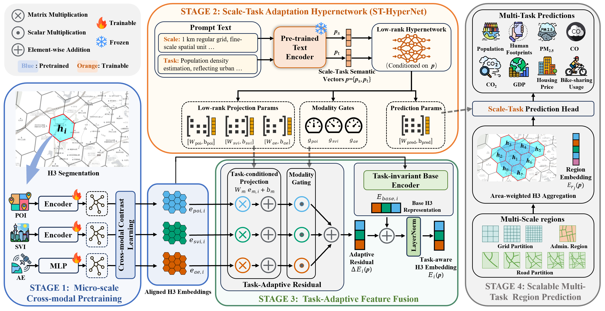

# ScaleCity: Multi-Scale Urban Region Representation Learning via a Prompt-Conditioned Hypernetwork

This is the official implementation of **ScaleCity**.

ScaleCity is a framework for urban multi-scale representation learning and downstream
indicator prediction. It learns city grid embeddings via multimodal contrastive
pretraining, then predicts a range of urban indicators (population, air quality, GDP,
housing price, shared-bike ridership, etc.) across multiple spatial scales (road-network
blocks L1–L5 / L11, and regular grids 1/3/5 km) using prompt-conditioned,
multi-task learning.

The framework consists of two components:

1. **Pretraining** (`pre_train/`): three-modality contrastive learning that produces
   city grid embeddings.
2. **Downstream learning** (`prompt_learning/`): prompt-conditioned multi-task prediction
   built on top of the pretrained embeddings.



## Project structure

```
CityScale/
├── pre_train/                  # Multimodal contrastive pretraining
│   ├── config.py               # paths, model names, GPUs, hyperparameters
│   ├── models.py               # UrbanGraphModel: 3-modality encoders + GAT + projection
│   ├── data_utils.py           # data loading, UrbanDataset, UrbanGraphCollator
│   ├── train_torchrun.py       # DDP training entry point (torchrun)
│   └── output/                 # pretrained grid embeddings
│
└── prompt_learning/            # Downstream prediction
    ├── config.py               # main config: city, embedding path, tasks
    ├── model.py                # UrbanPromptModel (dual-stream + HyperNetwork)
    ├── dataset.py              # UrbanDataset, urban_collate_fn
    ├── utils.py                # spatial mapping, scaler, prompt encoding, metrics
    ├── train.py                # K-fold training
    └── config/
        ├── TASKS.json          # task registry (task name -> data file)
        └── SCALE_DEFINITIONS.json  # scale definitions
```

## Installation

```bash
pip install -r requirements.txt
```

Tested with Python 3.9+ and PyTorch 2.x. A CUDA-capable GPU is recommended.

Local model weights (CLIP, text encoder) are loaded offline from paths configured in
`pre_train/config.py` and `prompt_learning/config.py`; update these paths for your
environment.

## Usage

### Pretraining

```bash
cd pre_train

# Multi-GPU training (GPU count from Config.GPU_IDS)
torchrun --nproc_per_node=4 train_torchrun.py

# Single-GPU debugging
python train_torchrun.py
```

Output: `pre_train/output/{CITYNAME}/{timestamp}/{timestamp}.pkl` (grid embeddings).

### Downstream training

```bash
cd prompt_learning

# K-fold cross-validation training
python train.py
```

## Configuration

### Active tasks
Edit `ACTIVE_TASKS` in `prompt_learning/config.py`. Comment out a task to disable it.

### Base scale
`BASE_SCALE` in `prompt_learning/config.py` sets the spatial unit used to partition
train/validation sets.

### Embedding / model pairing
`EMBEDDING_PATH` must use the embedding the downstream model was trained with.

